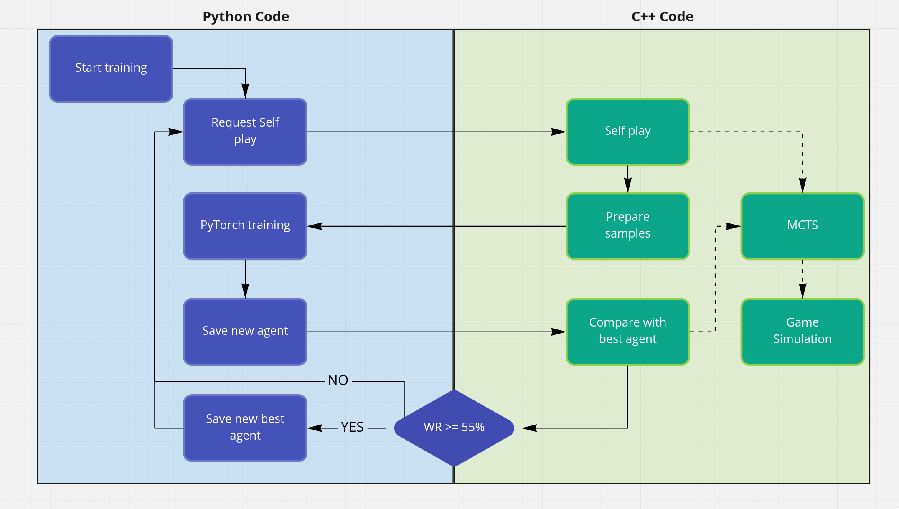

# WroclawZero
AlphaZero like implementation for CodinGame




# Running

``` 
python build/bin/python_training/main.py configs/config.yaml
```

# Tensorboard

tensorboard --logdir=data/


# Compressing

```
./build/bin/compress_weights <file with weights> <out file>
```

then you need to copy the output and paste in CodinGame